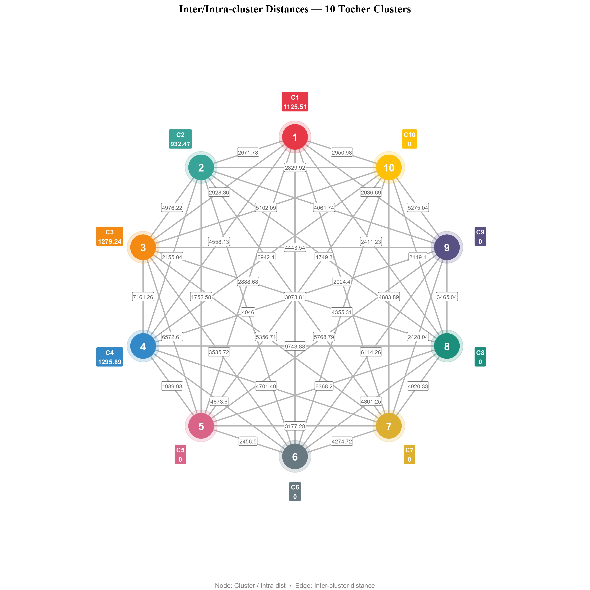
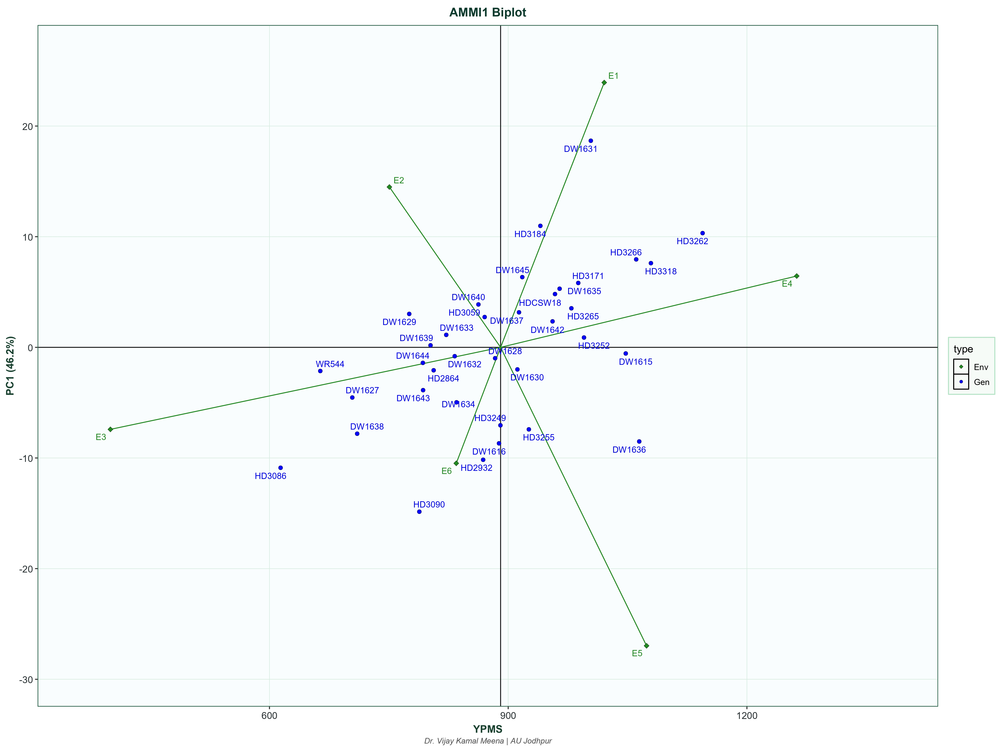
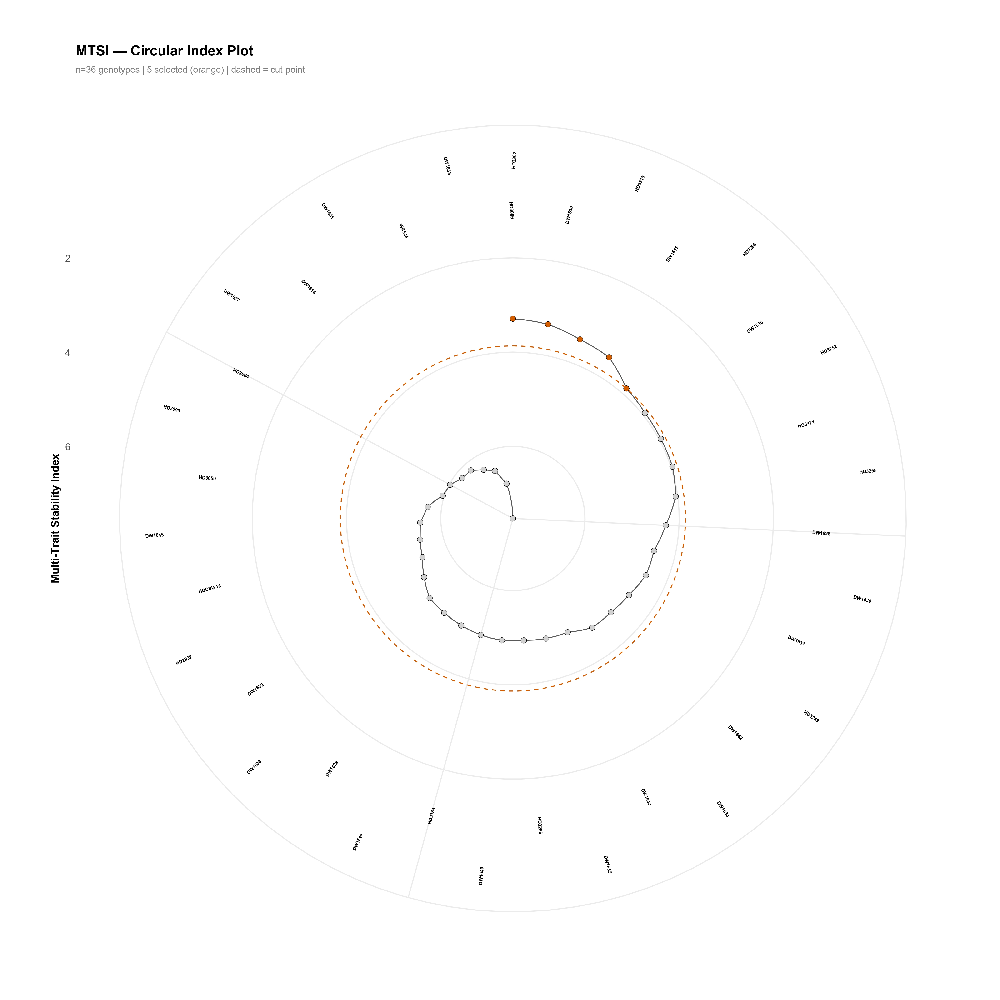

# 🌿 Plant Breeding Analytics Suite

[](https://www.r-project.org/)
[](https://shiny.posit.co/)
[](LICENSE)
[](mailto:vjkamal93@gmail.com)

A unified, professional **R Shiny** dashboard combining three analytical modules for plant breeding research:

| Module | Description |
|--------|-------------|
| **D² Genetic Diversity Analyser** | Mahalanobis D² distances, Tocher clustering, PCA, MANOVA, Pearson correlation |
| **MET Analysis Suite (AMMI / GGE)** | Multi-environment trial analysis — stability, AMMI, GGE biplots |
| **Multi-Trait Selection Suite** | MTSI, MGIDI, FAI-BLUP, Smith-Hazel index, GT/GYT biplots, Venn diagrams |

---

## 📸 Screenshots

> *(Add screenshots to `docs/screenshots/` and update paths below)*

| D² Diversity | MET Stability | Multi-Trait Selection |
|---|---|---|
|  |  |  |

---

## 🧬 Dataset Description

The repository includes real wheat (*Triticum aestivum* L.) phenotyping data collected under **terminal heat stress** conditions:

### `data/MET_wheat_data.csv` — Multi-Environment Trial
- **Crop:** Wheat (*T. aestivum* L.)
- **Environments:** 6 (E1–E6)
- **Genotypes:** 36
- **Replications:** 3
- **Traits (11):** HDNG, DTM, GFD, PH, SL, GWPS, GNPS, SPMS, YPMS, BYPMS, TGW
- **Use:** MET Analysis Suite & Multi-Trait Selection Suite

### `data/DWR_raw_data.csv` — D² Raw Data (Single Environment)
- **Condition:** Terminal Heat Stress environment
- **Genotypes:** 36 | **Replications:** 3
- **Traits (11):** HDNG, DTM, GFD, PH, SL, GWPS, GNPS, SPMS, YPMS, BYPMS, TGW
- **Column format:** `GEN, REP, trait1, trait2, …`
- **Use:** D² Genetic Diversity Analyser (Raw Data upload)

### `data/DWR_genotype_means.csv` — D² Genotype Means
- **Genotypes:** 36 | **Traits:** 11
- **Column format:** `GEN, trait1, trait2, …`
- **Use:** D² Genetic Diversity Analyser (Genotype Means upload)

### Trait Abbreviations

| Abbreviation | Full Name | Unit |
|---|---|---|
| HDNG | Heading date | Days |
| DTM | Days to maturity | Days |
| GFD | Grain filling duration | Days |
| PH | Plant height | cm |
| SL | Spike length | cm |
| GWPS | Grain weight per spike | g |
| GNPS | Grain number per spike | No. |
| SPMS | Spikes per m² | No. |
| YPMS | Yield per m² | g |
| BYPMS | Biological yield per m² | g |
| TGW | Thousand grain weight | g |

---

## ✨ Features

### Module 1 — D² Genetic Diversity Analyser
- Upload raw replicated data **or** pre-computed genotype means
- **MANOVA** + univariate ANOVA per trait
- **Mahalanobis D²** distance matrix with interactive heatmap
- **Tocher clustering** — membership table, inter/intra-cluster distances, dendrogram, network plot
- **PCA** — scree plot, biplot, eigenvalues, loadings, cluster overlay
- **Pearson correlation** heatmap with significance table
- Full CSV + PDF export

### Module 2 — MET Analysis Suite
- Descriptive statistics + GxE heatmap
- Individual & pooled ANOVA + Bartlett homogeneity test
- **ANOVA-based stability** — Ecovalence (Wricke), Shukla's σ²
- **Regression stability** — Eberhart–Russell (bi, S²di)
- **Non-parametric stability** — Lin & Binns superiority (Pi), Fox top-third
- **Factor Analysis** of GE interaction
- **Comprehensive wrap** — `ge_stats()` (all parameters in one table)
- **AMMI** — AMMI1, AMMI2, AMMI biplot; ASV + WAAS index
- **GGE** — 7 biplot types × 3 SVP options

### Module 3 — Multi-Trait Selection Suite
- Mixed-model fitting: `gamem_met()` + `waasb()` from **metan**
- Variance components (BLUP-based)
- **MTSI** — Multi-Trait Stability Index
- **MGIDI** — Multi-trait Genotype-Ideotype Distance Index
- **FAI-BLUP** — Factor Analysis and Ideotype-Design
- **Smith-Hazel** classical selection index
- **Direct selection** on yield trait
- **Selection differentials** (Table 3), coincidence index, **4-way Venn diagram**
- **GT / GYT biplots**
- **Radar chart** for multi-trait comparison
- Strengths & Weaknesses plots for selected genotypes
- Full XLSX + PDF export

---

## 🛠️ Installation

### Prerequisites
- R ≥ 4.1.0
- RStudio (recommended)

### Install Required Packages

```r
pkgs <- c(
  "shiny", "shinydashboard", "shinyWidgets", "shinyjs", "shinycssloaders",
  "DT", "plotly", "ggplot2", "dplyr", "tidyr", "readxl", "writexl",
  "reshape2", "RColorBrewer", "ggrepel", "scales", "viridis",
  "factoextra", "FactoMineR", "Hmisc", "biotools", "ggdendro", "dendextend",
  "metan", "corrplot", "ggforce", "patchwork", "tibble", "purrr",
  "fmsb", "grDevices"
)
install.packages(pkgs)
```

### Run the App

```r
# Option 1 — from RStudio
shiny::runApp("app.R")

# Option 2 — directly
source("app.R")
```

---

## 📁 Repository Structure

```
PlantBreedingSuite/
│
├── app.R                          # Main Shiny application (all 3 modules)
│
├── data/
│   ├── MET_wheat_data.csv         # Multi-environment trial data (6E × 36G × 3R)
│   ├── DWR_raw_data.csv           # D² raw data — terminal heat stress (36G × 3R)
│   └── DWR_genotype_means.csv     # D² genotype means (36G × 11 traits)
│
├── docs/
│   ├── USER_GUIDE.md              # Detailed step-by-step usage guide
│   └── screenshots/               # App screenshots
│
├── README.md                      # This file
├── LICENSE                        # MIT License
└── .gitignore                     # R / RStudio / OS ignores
```

---

## 🚀 Quick Start

### D² Diversity Analysis
1. Open the app → **D² Upload** tab
2. Upload `data/DWR_raw_data.csv` as **Raw Data** (trait start column = 3)
3. Upload `data/DWR_genotype_means.csv` as **Genotype Means**
4. Click **Load & Validate Data**
5. Run MANOVA → D² Distances → Tocher → PCA → Correlation in sequence

### MET / Stability Analysis
1. Go to **MET — Data Upload**
2. Upload `data/MET_wheat_data.csv`; set ENV = `ENV`, GEN = `GEN`, REP = `REP`
3. Click **Load Data**
4. Navigate to any analysis tab and click **Run**

### Multi-Trait Selection
1. Go to **MT — Data & Settings**
2. Upload `data/MET_wheat_data.csv`; map ENV, GEN, REP columns
3. Set trait goals (↑ higher / ↓ lower) and selection intensity (%)
4. Go to **MT — Fit Models** → click **Fit gamem_met + waasb**
5. Run MTSI → MGIDI → FAI-BLUP → Smith-Hazel in any order

---

## 📖 Citation

If you use this application or the data in your research, please cite:

```
Meena, V.K. (2025). Plant Breeding Analytics Suite: A unified R Shiny dashboard
for D² diversity analysis, multi-environment trial stability, and multi-trait
selection indices. Agriculture University Jodhpur.
GitHub: https://github.com/vjkamal93/PlantBreedingSuite
```

### Key Packages to Cite
- **metan**: Olivoto & Lúcio (2020) *The Plant Phenome Journal* — doi:10.1002/ppj2.20017
- **biotools**: Silva (2017) *R package* — CRAN
- **FactoMineR**: Lê et al. (2008) *Journal of Statistical Software*

---

## 👨‍🔬 Developer

**Dr. Vijay Kamal Meena**  
Assistant Professor (GPB)  
Agriculture University Jodhpur, Rajasthan, India

| | |
|---|---|
| 🎓 | M.Sc. & Ph.D. — ICAR-IARI, New Delhi |
| 🏆 | ICAR-ARS 2021 |
| 🏛️ | Agriculture University Jodhpur |
| 📧 | vjkamal93@gmail.com |
| 📧 | vijaykamal@aujodhpur.ac.in |
| 📞 | +91 9449509856 |

---

## 📄 License

This project is licensed under the **MIT License** — see [LICENSE](LICENSE) for details.

---

## 🤝 Contributing

Contributions, bug reports, and feature requests are welcome!  
Please open an [issue](../../issues) or submit a pull request.

---

*Plant Breeding Analytics Suite v3.0 | 2025 | Agriculture University Jodhpur*
